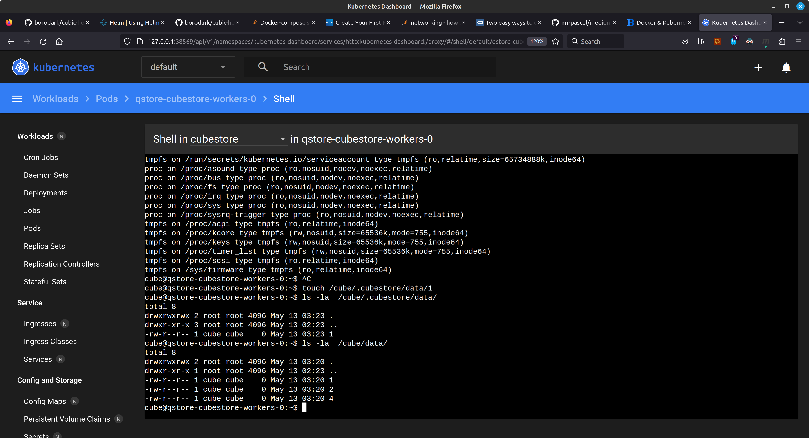

```yaml
apiVersion: v1
kind: PersistentVolume
metadata:
  name: efs-whale
spec:
  capacity:
    storage: 5Gi
  volumeMode: Filesystem
  accessModes:
    - ReadWriteMany
  persistentVolumeReclaimPolicy: Retain
  csi:
    driver: efs.csi.aws.com
    volumeHandle: fs-0xvvxcxcvxccvxc
```

The `volumeHandle: fs-0fb3348fe1f070053` is refering to a instance of AWS Elastic File System.

### the PVC created from the original chart

```yaml
---
# Source: cubestore/templates/pvc.yaml
apiVersion: v1
metadata:
  name: qstore-cubestore-remote-storage
  labels:
    app.kubernetes.io/component: remote-storage
    app.kubernetes.io/name: cubestore
    app.kubernetes.io/instance: qstore
    io: debug
  annotations:
    helm.sh/resource-policy: keep
    io.io/tags: '{"env": "test", "team": "lupi" }'
spec:
  accessModes:
    - "ReadWriteMany"
  resources:
    requests:
      storage: 4Gi
  storageClassName: pvc
```


## the way of samurai AKA putting it all together

https://git.rockfin.com/terraform/aws-efs-tft


## Results


### user id group id is not root




### Deploy in minicube


## Developing  charts


`helm --debug install qstore . -f cube-store.yaml`

https://kubernetes.io/docs/tasks/configure-pod-container/security-context/

https://unofficial-kubernetes.readthedocs.io/en/latest/concepts/policy/security-context/

```
io@io-All-Series:~/projects/cubes/cubic-helm/charts/cubestore$ helm --debug install qstore . -f cube-store.yaml > deploy_I.md 
install.go:200: [debug] Original chart version: ""
install.go:217: [debug] CHART PATH: /home/io/projects/cubes/cubic-helm/charts/cubestore

client.go:385: [debug] checking 6 resources for changes
client.go:406: [debug] Created a new ServiceAccount called "qstore" in default

client.go:678: [debug] Looks like there are no changes for PersistentVolumeClaim "qstore-cubestore-remote-storage"
client.go:406: [debug] Created a new Service called "qstore-cubestore-router" in default

client.go:406: [debug] Created a new Service called "qstore-cubestore-headless" in default

client.go:406: [debug] Created a new StatefulSet called "qstore-cubestore-router" in default

client.go:406: [debug] Created a new StatefulSet called "qstore-cubestore-workers" in default

```

https://github.com/mr-pascal/medium-local-docker-image-minikube/tree/master

```
### Build container
docker build -t pz/demo .

### Run container
docker run -it --rm -p 8080:8080 pz/demo

## ---

### Load local Docker image into Minikube
minikube image load pz/demo

### Build container directly in minikube
minikube image build -t pz/demo .

### Check Deployment logs
kubectl logs deployment.apps/myapp

### Port forward port to Deployment
kubectl port-forward deployment/myapp 8080:8080

```

`clickhouse-client -u vitals --password 111111`

`kubectl cp ~/<your-file-here> factorio/factorio-0:/tmp/<your-file-there>`

ingress.hostname
vitals-banker-performance-api.datalake-sandbox.foc.zone


```
helm upgrade vitalsch oci://registry-1.docker.io/bitnamicharts/clickhouse -f vitals-clickhouse.yaml 
helm install vitalsch oci://registry-1.docker.io/bitnamicharts/clickhouse -f vitals-clickhouse.yaml 
```
Actual error message from rancher

```
failed to provision volume with StorageClass "ebs-gp3": rpc error: code = InvalidArgument desc = Volume capabilities MULTI_NODE_MULTI_WRITER not supported. Only AccessModes[ReadWriteOnce] supported.
```

` helm --debug install vitalsqbstore . -f ../../vitals-cubestore-sandbox.yaml  | tee deploy_I`

Equally useful undeploy:

`delete chart `helm --debug delete vitalsqbstore`

