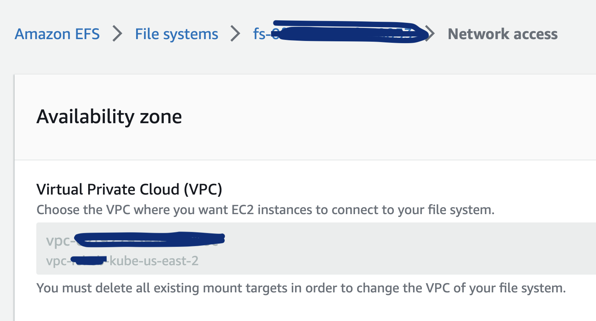
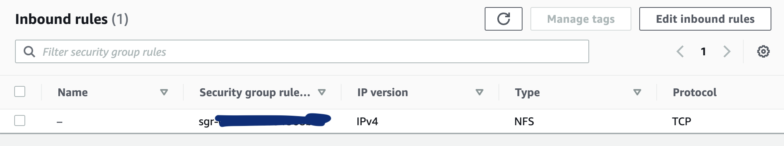
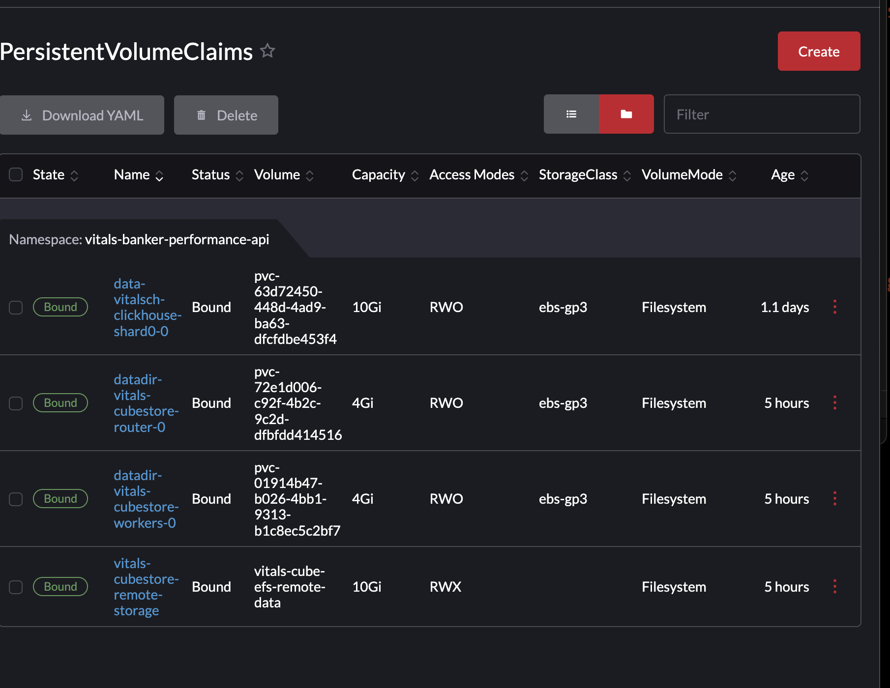

# how to create a development instance of cube deployment in the sandbox.

The goal of the exercise is to have a working cube deployment running in the development mode connected to a database. This is different from local docker compose development environment. This proof of concept uses Helm Charts. Same Helm charts will be used to deploy a cube in production environment.

The minimum production deployment of Cube consist of:
- cubestore: a `router`, a `worker` or a few
- cube: `an API serving instance` connected to the above mentioned router

    Running a `cubestore` with multiple `worker`s requares a shared file system. It must be available to all instances: https://cube.dev/docs/reference/environment-variables#cubestore-remote-dir `

Having a goal of creating a shared volume for all cube store `worker` pods to be used as shared `remote-storage` and given in the following combination of conditions:
  - We do not have Dynamic Provisioning working now (2023-06-01 as per JasonB ).
  - This is POC in sandbox

Decisions were made to:
  - use a staticly provisioned volume
  - the AWS EFS is created manualy in AWS console 


The concept to follow described here: https://kubernetes.io/docs/tasks/configure-pod-container/configure-persistent-volume-storage/
  1. Create a PersistentVolume backed by physical storage. Do not associate the volume with any Pod.
  2. Create a PersistentVolumeClaim that is automatically bound to a suitable PersistentVolume.
  3. Create a Pod that uses the above PersistentVolumeClaim for storage.

While the Helm Charts we use here take care of later two let's concentrate on implementing a PersistentVolume backed by AWS EFS of a certain size and rely on the guaranties promissed by K8s cluster to bind most suitable volume. At the time of writing the believe is that bind will happened based on matching the size and capabilities of the volume to be readable and a writeable by many instances, see `ReadWriteMany` here https://kubernetes.io/docs/concepts/storage/persistent-volumes/#access-modes.


## Manually create EFS

_TODO: bother AWS to show a file system ARN  the web console page_

Three important points:

  * EFS must be in the k8s cluster VPC.

  


  * The Security Groups have to allow access from a K8s cluster IPs to port `2049` 
  (also known as NFS Service port)

  


  * IAM Role Access
  In order for cluster to use the file system the policy has to be attached to the role the `cubestore` is running with in the cluster.
  
  Example of minimum access required:
  ```json
{
            "Sid": "allowefsmountscubestoreremotedatadir",
            "Effect": "Allow",
            "Action": [
                "elasticfilesystem:ClientMount",
                "elasticfilesystem:ClientWrite",
                "elasticfilesystem:DescribeMountTargets",
                "elasticfilesystem:DescribeFileSystems",
                "elasticfilesystem:DescribeFileSystemPolicy"
            ],
            "Resource": "arn:aws:elasticfilesystem:us-east-2:XXXXXXXXXXXX:file-system/fs-0xxxxxxxxxxxxxx"
}
  ```

### manualy create volume

Using the following yaml [manual-efs-volume.yaml](./manual-efs-volume.yaml): 

```yaml
apiVersion: v1
kind: PersistentVolume
metadata:
  name: lupi-cube-efs-remote-data
spec:
  capacity:
    storage: 10Gi
  volumeMode: Filesystem
  accessModes:
    - ReadWriteMany
  persistentVolumeReclaimPolicy: Retain
  csi:
    driver: efs.csi.aws.com
    volumeHandle: fs-0fb3348fe1f0XXXXX

```

the following command is executed:

`kubectl apply -f manual-efs-volume.yaml`

This is done at the cluster level, no `namespace` is needed:

An instance of AWS Elastic File System created earlier is mentioned 
in `volumeHandle: fs-0fb3348fe1f0XXXXX`.


To prevent the claster to use `default=ebs-gp3` storage class and bind only to manually provisioned AWS EFS the charts updated to produce the PVC with `volumeName: lupi-cube-efs-remote-data`
and  `storageClassName: "" `:

#### confirmed working

```yaml
---
# Source: cubestore/templates/pvc.yaml
kind: PersistentVolumeClaim
apiVersion: v1
metadata:
  name: lupi-cubestore-remote-storage
  labels:
    app.kubernetes.io/component: remote-storage
    app.kubernetes.io/name: cubestore
    app.kubernetes.io/instance: lupi
    io: debug
  annotations:
    pv.beta.kubernetes.io/gid: "1001" # TODO if: else: here
    helm.sh/resource-policy: keep
    io.io/tags: '{"env": "mine", "team": "lupi" }'
spec:
  accessModes:
    - "ReadWriteMany"
  volumeName: lupi-cube-efs-remote-data
  resources:
    requests:
      storage: 10Gi
  storageClassName: ""
---
```

The redeploy of the `cubestore` charts produced the bound set of `PersistentVolumeClaim`s:





## Short: The way of samurai 

AKA putting it all together

### user id group id is not root


### Deploy in minicube


